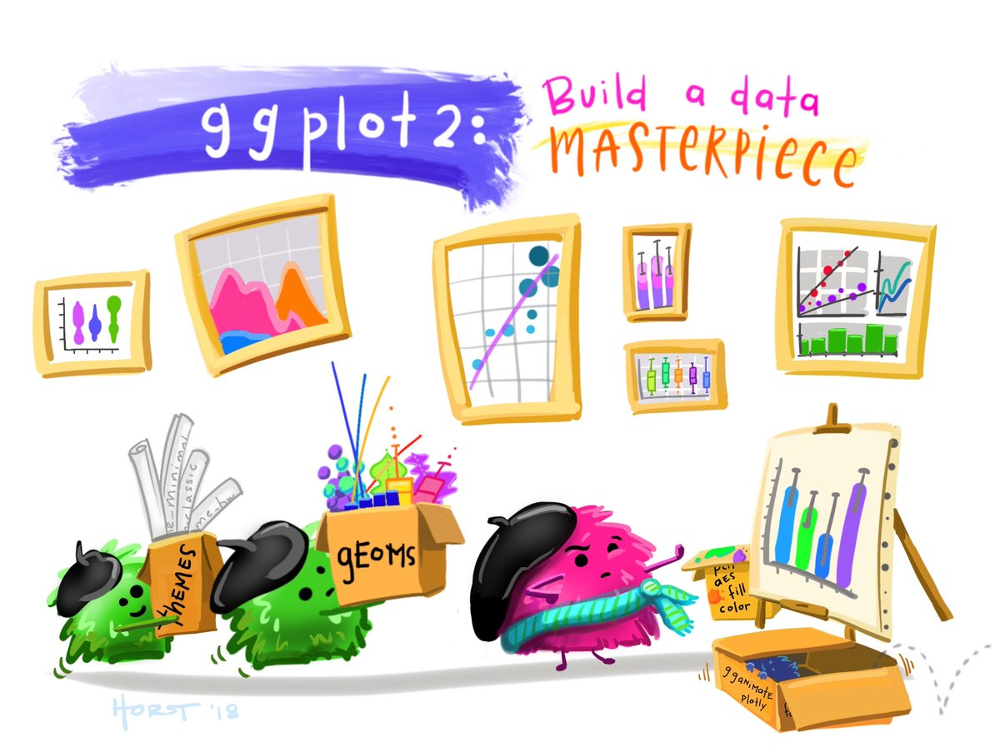

```{r setup, include=FALSE}
knitr::opts_chunk$set(echo = TRUE)
```

```{r echo=T, results='hide', include=FALSE}
install.packages("gapminder", repos="https://cran.cnr.berkeley.edu")
library("gapminder")

install.packages("ggplot2", repos="https://cran.cnr.berkeley.edu")
library("ggplot2")

install.packages("gganimate", repos="https://cran.cnr.berkeley.edu")
library("gganimate")
```

```{r opening, fig.cap="Designed by [Allison Horst](https://twitter.com/allison_horst), @allison_horst", out.width='60%', echo=F, fig.align="center"}

```

There are several packages that can be used in R to create graphs. The most famous one is called **ggplot2**.

All R packages are freely available online. You just need to install them in your R workspace. Once installed, all your packages are saved in a "library" from where you can retrieve them when needed. 

```{r eval = F}
install.packages("ggplot2", repos="https://cran.cnr.berkeley.edu")
library("ggplot2")
```

## Graphs

The package **ggplot2** is better at creating graphs and we can include more arguments in our functions, so that we can personalize the graph. 

```{r}
students <- c("Sam", "David", "Annie", "Kate", "Mary")
commuting_time <- c(15, 6, 8, 9, 23)
data = as.data.frame(cbind(students, as.numeric(commuting_time)))
```

```{r echo=T, results='hide', include=FALSE}
data$commuting_time = as.numeric(levels(data$V2))[data$V2]
data$V2 <- NULL
```

```{r}
my_super_cool_plot <- ## Call your data and identify the x & y axis
                      ggplot(data, aes(x = students, y = commuting_time)) +
                      
                      ## Set the colors for each of your bar
                      geom_col(fill = c("slategrey", "royalblue2", "darkred", "gold", "orange")) +
                      
                      ## Add labels and set the color that "fills" the labels
                      geom_label(aes(label = commuting_time), fill = "white") + 
  		                
                      ## Do you want to have a background?
                      guides(fill = FALSE) + 
                      
                      ## Set labels for the axis, title, subtitle, and caption
                      labs(x = NULL, 
                           y = "Percent", 
                           title = "Commuting time plot",
                           subtitle = "PPOL405 - Intro to R", 
                           caption = "Source & Other examples: https://datavizf18.classes.andrewheiss.com/class/05-class/") +
                      
                      ## Size and font of the labels
                      theme(plot.title = element_text(face = "bold", size = 14), 
			                      plot.subtitle = element_text(face = "italic", size = 12),
                            axis.text = element_text(size=12))


my_super_cool_plot
```

```{r, include=FALSE}
tutorial::go_interactive(height = 400)
```

```{r ex="coolplot", type="pre-exercise-code"}
students <- c("Sam", "David", "Annie", "Kate", "Mary")
commuting_time <- c(15, 6, 8, 9, 23)
data = as.data.frame(cbind(students, as.numeric(commuting_time)))

data$commuting_time = as.numeric(levels(data$V2))[data$V2]
data$V2 <- NULL

```

```{r ex="coolplot", type="sample-code"}

library(ggplot2)
data
    
```

We can also animate graphs. We can imagine that the city is creating a new bus stop for students at a local university, which is supposed to shorten commuting time for students. 

We sample 5 students and collect information about their commuting time before and after the new bus stop and we store them in a dataframe. You should be familiar with these commands!

```{r tut=FALSE}

students <- c("Annie", "Sam", "Sallie", "Tom", "Amanda", "Annie", "Sam", "Sallie", "Tom", "Amanda")

commuting_time <- c(14, 7, 23, 8, 9, 10, 5, 18, 5, 4) 

day <- c(rep("Pre", 5), rep("Post", 5))

data <- as.data.frame(cbind(students, commuting_time, day))

data
```

```{r echo=T, results='hide', include=FALSE, tut=FALSE}
data$commuting_time = as.numeric(levels(data$commuting_time))[data$commuting_time]
data$day = factor(data$day,levels(data$day)[c(2,1)])
```

Now we can use ggplot to create an interactive graph that shows how the commuting time has decreased after the bus stop has been implemented.

```{r message=FALSE, warning=FALSE, tut=FALSE}

ggplot(data, aes(y=commuting_time, x=students, fill=day)) + 

       geom_bar(position="dodge", stat="identity", color="white") + 

       labs(x        = "Students", 
            y        = "Commuting Time", 
            title    = 'Commuting Time:{closest_state} ',
	          subtitle = "Very Cool Graph in R", 
            caption  = "Source: PPOL405") +

      scale_fill_manual(values = c("darkred", "darkblue")) +

      theme(plot.title    = element_text(face = "bold", size = 14), 
            plot.subtitle = element_text(face = "italic", size = 12),
            axis.text     = element_text(size=12)) + 

      transition_states(day, transition_length = 16, state_length = 16) +
      exit_shrink() + 
      enter_grow() +

      ease_aes('sine-in-out')
```

```{r message=FALSE, warning=FALSE, tut=FALSE}

ggplot(gapminder, aes(gdpPercap, lifeExp, size = pop, colour = country)) +
       geom_point(alpha = 0.7, show.legend = FALSE) +
       scale_colour_manual(values = country_colors) +
       scale_size(range = c(2, 12)) +
       scale_x_log10() +
       facet_wrap(~continent) +
       
       # Here comes the gganimate specific bits
       labs(title    = 'Year: {frame_time}', 
            subtitle = 'Source: https://github.com/thomasp85/gganimate', 
            x        = 'GDP per capita', 
            y        = 'life expectancy') +
       transition_time(year) +
       ease_aes('linear')
```


```{css, echo=F}

.powered-by-datacamp {
  display: none !important;
}

.datacamp-exercise {
  margin: 0 0 1em 0 !important;
}

p {
color: black;
margin: 0 0 20px 0;
}

p.caption {
    text-align: center;
    font-style: italic;
}

td {
    padding: 3px 10px 3px 10px;
    }

table
{ 
    margin-left: auto;
    margin-right: auto;
    margin-top:20px;
    margin-bottom:20px;
}

h1, h2{
  margin-top:100px;
  margin-bottom:20px;
}

H5{
    text-align: center;
    color: gray;
    font-size:0.8em;
}

img {
    max-width: 90%;
    display: block;
    margin-right: auto;
    margin-left: auto;
    margin-top:30px;
    margin-bottom:20px;
}

pre {
  overflow-x: auto;
}

pre code {
   display: block; 
   padding: 0.5em;
   margin-bottom:20px;
}

code {
  font-size: 92%;
  border: 10px solid #F8F8F8;
  margin-bottom: 2px;
}

code[class] {
  background-color: #F8F8F8;
}

```