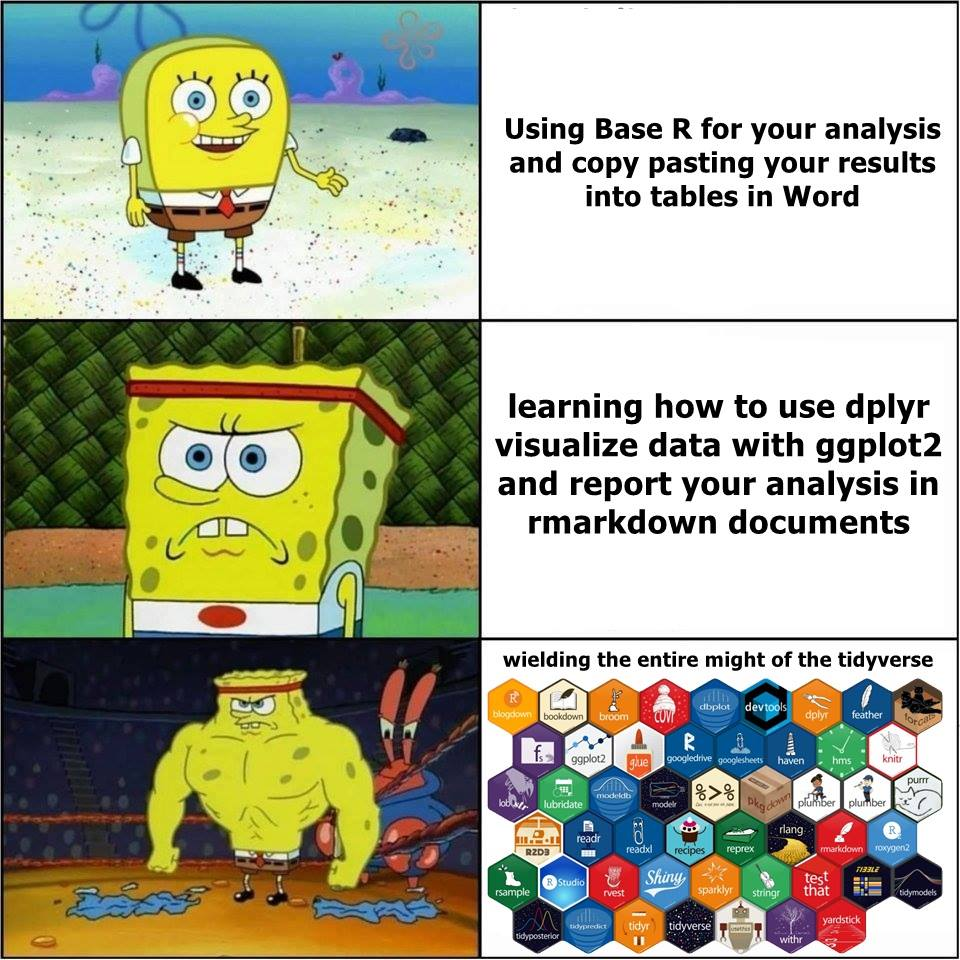
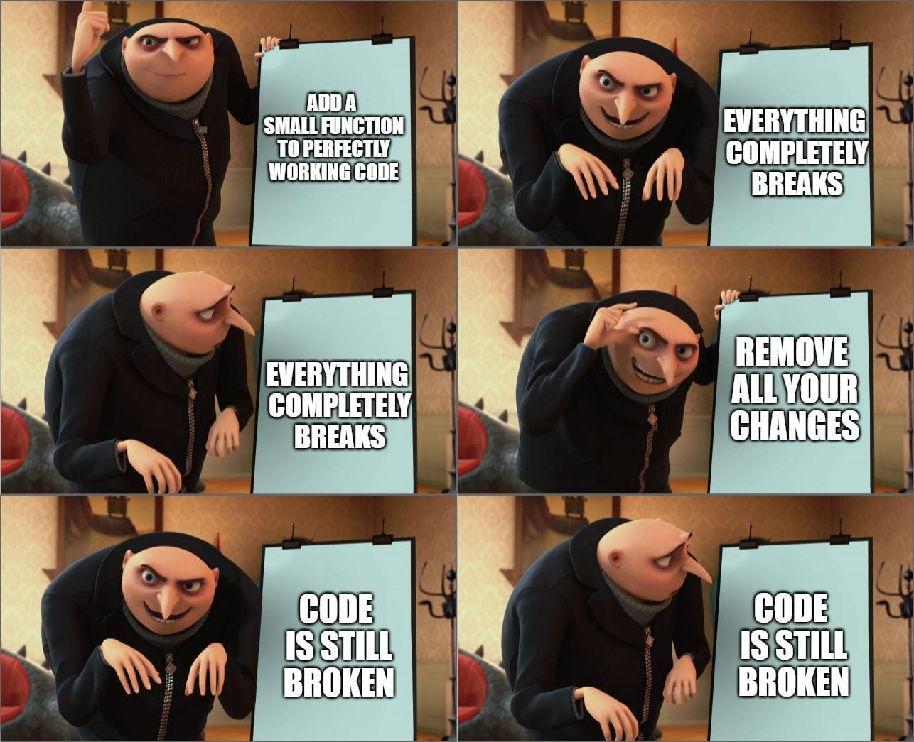

R is a free open source statistical software: You can freely download R on your computer and use any of the packages that are developed by other people around the world.

```{r r-system, fig.cap="R ecosystem", out.width='40%', echo=F }
knitr::include_graphics( "FIGURE/r-system.png" )
```

Because it's free and open source, R has more packages and functionalities than traditional statistical software: you can use R to perform basic operations that you would do in Excel but also more advanced data visualizations, download data from the Internet through API, or interactive graphs.. 

```{r dataset, fig.cap="R is well known for its graphic capacities", out.width='60%', echo=F }
knitr::include_graphics( "FIGURE/Graphs.png" )
```

Because it is a programming language, R allows you to move beyond statistical analysis and create websites (like this one), Word documents, or slide presentations. 

```{r r-packages, fig.cap="There are different levels of using R", out.width='40%', echo=F }

```

Moreover, R is very much requested by employers in both [private and public sector](https://blog.revolutionanalytics.com/2014/05/companies-using-r-in-2014.html) and has a large community of users who have made available several content online.

But:

- Some initial learning costs: programming can be difficult and computers are stupid. Basic errors can take hours to be solved, it doesn't matter how expert you are (ask me how many hours it took to get this website online!). Most likely, it will require a bit more patience and perseverance than learning traditional softwares such as Excel or Word.

```{r programming, fig.cap="When you learn R", out.width='60%', echo=F }

```

If you are not convinced yet:

R has been lauched more than 10 years ago and immediately capture the [IMAGINATION OF MANY](https://www.nytimes.com/2009/01/07/technology/business-computing/07program.html). You might not have heard, but [NERD IS THE NEW BLACK](https://www.wsj.com/articles/SB10001424127887323478304578332850293360468), data science is the [SEXIEST JOB OF THE 21ST CENTURY](https://hbr.org/2012/10/data-scientist-the-sexiest-job-of-the-21st-century), and there is [NOTHING HOTTER](https://blog.revolutionanalytics.com/2015/01/r-is-still-hot-and-getting-hotter.html) than learning R.

# R for the public good

**Analyzing public data: [I Quant NY](https://iquantny.tumblr.com/)**

The author of this blog analyzed the publicly available data on the NY budget and discovered a $791 Million dollars mistake in the budget documents! The budget documents mistakenly allocated almost 800 million dollars to the "Protection of Foreign Missions", an amount of dollars greater than School Safety, Transit, Housing and Narcotics combined budgets - approximately 1% of NYC’s entire budget and 15% of the NYPD’s entire budget.     

**Using public data to make predictions: [Chicago Food Inspections](https://chicago.github.io/food-inspections-evaluation/)**

"There are over 15,000 food establishments across the City of Chicago that are subject to sanitation inspections by the Department of Public Health. Three dozen inspectors are responsible for checking these establishments, which means one inspector is responsible for nearly 470 food establishments. The Department of Public Health has systematically collected the results of nearly 100,000 sanitation inspections; meanwhile, other city departments have collected data on 311 complaints, business characteristics, and other information. With this information, the city's advanced analytics team and Department of Public Health teamed up to forecast food establishments that are most likely to have critical violations so that they may be inspected first. The result is that food establishments with critical violations are more likely to be discovered earlier by the Department of Public Health's inspectors." The code they use is freely available [here](https://github.com/chicago/food-inspections-evaluation/).


```{css, echo=F}

.powered-by-datacamp {
  display: none !important;
}

.datacamp-exercise {
  margin: 0 0 1em 0 !important;
}

p {
color: black;
margin: 0 0 20px 0;
}

p.caption {
    text-align: center;
    font-style: italic;
}

td {
    padding: 3px 10px 3px 10px;
    }

table
{ 
    margin-left: auto;
    margin-right: auto;
    margin-top:80px;
    margin-bottom:100px;
}

h1, h2{
  margin-top:100px;
  margin-bottom:20px;
}

H5{
    text-align: center;
    color: gray;
    font-size:0.8em;
}

img {
    max-width: 90%;
    display: block;
    margin-right: auto;
    margin-left: auto;
    margin-top:30px;
    margin-bottom:20px;
}

pre {
  overflow-x: auto;
}

pre code {
   display: block; 
   padding: 0.5em;
   margin-bottom:20px;
}

code {
  font-size: 92%;
  border: 10px solid #F8F8F8;
  margin-bottom: 2px;
}

code[class] {
  background-color: #F8F8F8;
}

```
